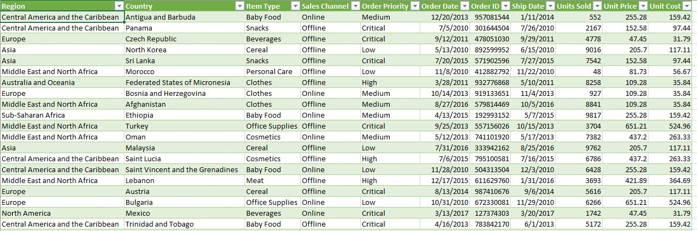

# Power-BI-Sales-Report

## Project Overview

This sales report project analyzes a dataset containing key information like region,country,item type,sales channels,order details and sales figures. By examining this data, the project aims to understand sales performance across different regions,products and channels. it seeks to identify trends, such as top-selling items and effective sales channels. Additionally, the aim of this project is to diva into the sales of this company between the year 2010-2017, and get some fact that can assist the business, some of the things we want to know about the data are;
* Production Expenses
* Revenue
* Profitability
* Profit Margin
  
Uitimately,the goals is to offer actionable recommendations to enhance sales performance and drive business growth.

## Objectives

* To provide recommendation for strategies to improve future sales based on the analysis
* To assist the company in making informed decisions and optimizing its operation
* To evaluate the sales trends of the company to understand whether the sales is growing,stable or declining.

## Date Source
The primary source of this dataset is a "sale-data-csv" file, containing detailed information about each sales made in a particular company.

## Tools
- SQL-Data Manipulation and Selection
- Power BI-Data cleaning and Creating Reports

  ## Data Cleaning/Preparation
In this preparation phase,we performed the following tasks;
1. Data loading and inspection
2. Handling missing values
3. Removed duplicate roles
4. Data cleaning and formatting

## Insight Page
 Production Expenses
 
 *  Rwanda incurs the highest production costs among the top ten revenue generated countries.
 *  Office supplies and household items account for the bulk for production costs,followed by other categories.
 *  Sub-Saharan Africa and Europe bear the brunt of production expenses,both exceeding $1 billion. However,Sub-Saharan Africa generates the highest profits.
 *  2015 withnessed the company's highest production costs,leading to lower income for that year.

   
 
   

   
   
